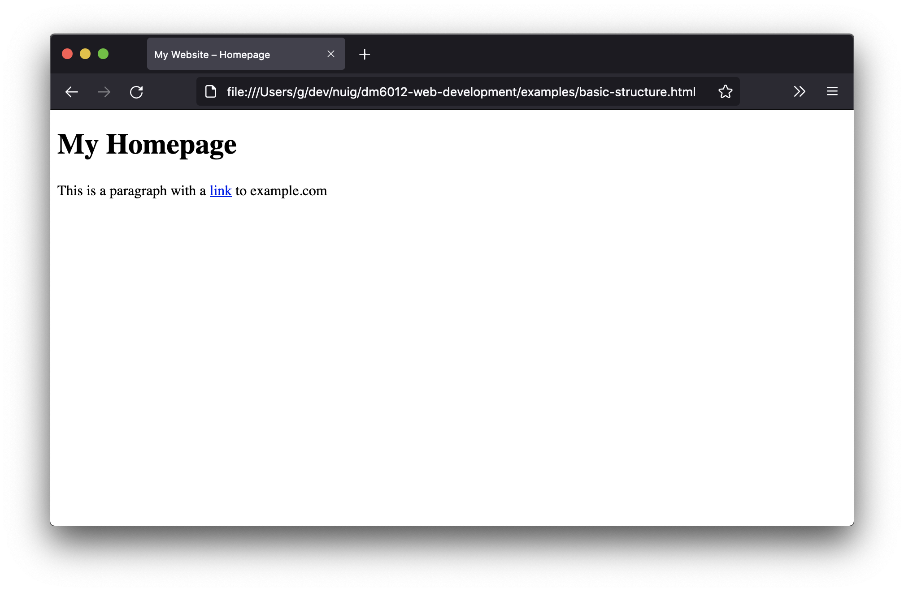
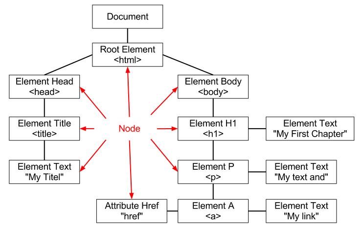
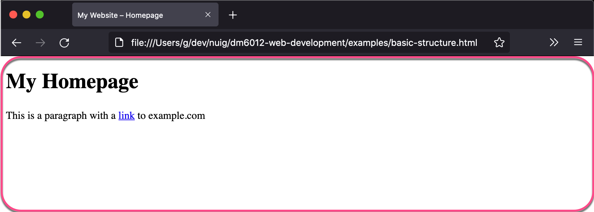
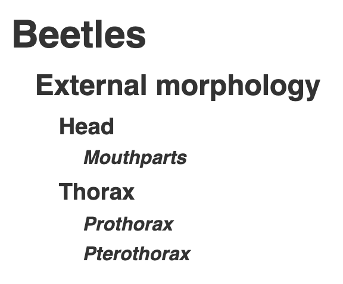
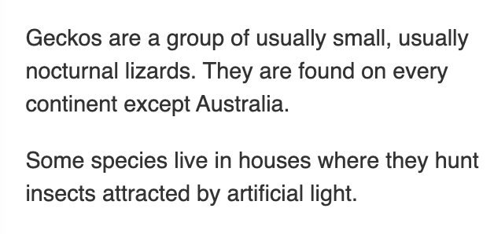

# HTML Basics

---

# Basic Structure of a HTML Document

```html
<!DOCTYPE html>
<html>
  <head>
    <title>My Website – Homepage</title>
  </head>
  <body>
    <h1>My Homepage</h1>
    <p>
      This is a paragraph with a <a href="http://example.com">link</a> another website.
    </p>
  </body>
</html>
```

---



--- 

# The DOM – Document Object Model 



An HTML Document can be visualised as a tree-like structure where each of the leaves represent DOM nodes, eg: elements, texts, and attributes.


---

# HTML Elements

---
## `<!DOCTYPE>` Doctype

Doctype tells the browser what version of HTML we using so it knows how to what HTML elements to expect.

`<!DOCTYPE html>` States we are using HTML5.

---

## `<head>` The Document Metadata (Header) element

The head element contains information (metadata) about the document, like its title.
We can reference any resources we might need for the document here, eg: 
- CSS styling
- JavaScript 
- SEO: keywords, description, author

--- 

## `<title>` Document Title element

The title element of your webpage shows in the window/tab of your browser.
Titles are important for SEO.


---

## `<body>` Document Body element

The body element contains the content of the document which displays in the browser's window.



---

## `<h1>`...`<h6>` Headings

There are six levels of headings: `<h1>`, `<h2>`, `<h3>`, `<h4>`, `<h5>` and `<h6>`.

Each HTML Document should only have one `<h1>` as the main heading for that webpage's content—using more is allowed but is not best practice.

Headings should not skip levels: `<h1>`, followed by `<h2>`, then `<h3>` and so on.

Avoid using heading elements to resize text.

<https://developer.mozilla.org/en-US/docs/Web/HTML/Element/Heading_Elements>

---

| HTML | Output |
| - | - |
| `<h1>Beetles</h1>`<br/>`<h2>External morphology</h2>`<br/>`<h3>Head</h3>`<br/>`<h4>Mouthparts</h4>`<br/>`<h3>Thorax</h3>`<br/>`<h4>Prothorax</h4>`<br/>`<h4>Pterothorax</h4>`||

---

## `<p>` Paragraph

The `<p>` element represents a paragraph. Paragraphs are usually represented in visual media as blocks of text separated from adjacent blocks by blank lines.

Paragraphs can be any structural grouping of related content, such as images or form fields.

<https://developer.mozilla.org/en-US/docs/Web/HTML/Element/p>

---

| HTML | Output |
| ---- | ------ |
| `<p>`<br/>`Geckos are a group of`<br/>`usually small, usually`<br/>`nocturnal lizards. They...`<br/>`</p>`<br/>  `<p>`<br/>`Some species live in houses`<br/>`where they hunt insects`<br/>`attracted by artificial...`<br/>`</p>` |            |

---

## `<a>` Anchor element

---

# Footnotes

### Doctypes for previous versions of HTML

**HTML 4.01**
`<!DOCTYPE HTML PUBLIC "-//W3C//DTD HTML 4.01 Transitional//EN" "http://www.w3.org/TR/html4/loose.dtd">`


**XHTML 1.1**
`<!DOCTYPE html PUBLIC "-//W3C//DTD XHTML 1.1//EN" "http://www.w3.org/TR/xhtml11/DTD/xhtml11.dtd">`

---

# Resources

**W3Schools** – Educational website for learning coding online
https://www.w3schools.com/html/default.asp
– Good resources for beginners and learning any web-technology for the first time.

**MDN Web Docs** – Resources for developers, by developers.
https://developer.mozilla.org/en-US/
– Good for understanding 

**WHATWG** – Web Hypertext Application Technology Working Group
<https://html.spec.whatwg.org/dev/>
– Maintains the HTML and DOM Living Standards since 2019
– Previously standards were maintained by [W3C: World Wide Web Consortium](https://www.w3.org)
Read more about the transition from W3C to WHATWG [here](https://www.w3.org/blog/2019/05/w3c-and-whatwg-to-work-together-to-advance-the-open-web-platform/).
